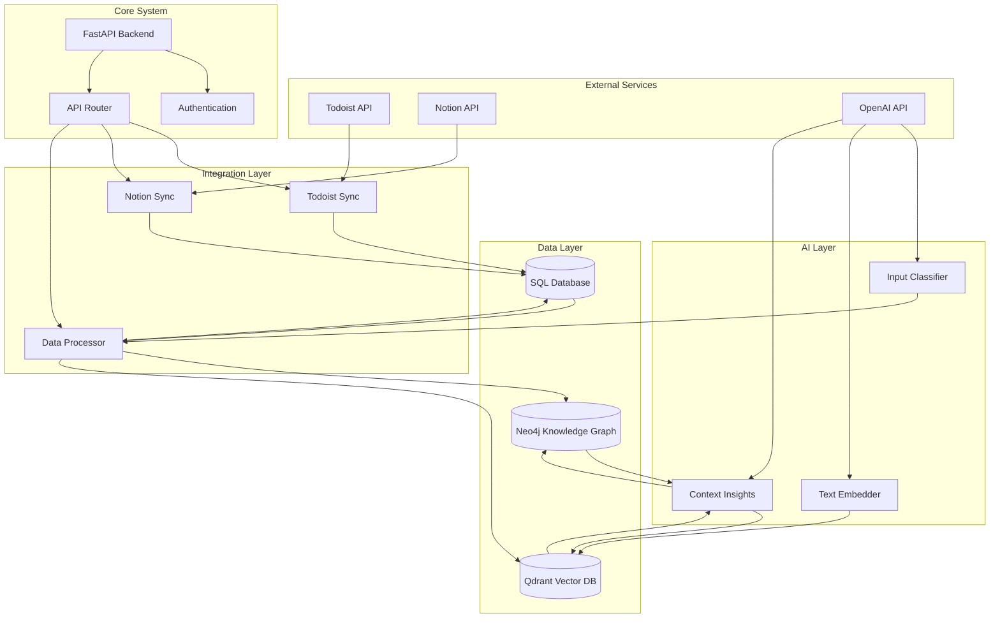

# AI-Assisted Personal Knowledge Management System

A scalable system that integrates Todoist and Notion with AI-powered knowledge management capabilities.

## Features

- **Task Management Integration**
  - Todoist integration for task tracking
  - Notion integration for project management
  - Unified task and project view

- **Knowledge Management**
  - Knowledge graph for structured relationships
  - Vector database for semantic search
  - Historical context tracking

- **AI Assistance**
  - Automatic classification of inputs
  - Context-aware insights
  - Smart task organization

## System Architecture



## Architecture

The system is built with a modular architecture:

```
├── api/                 # API endpoints and routes
├── core/               # Core business logic
├── db/                 # Database models and connections
├── integrations/       # External service integrations
├── knowledge/          # Knowledge management system
├── ml/                 # Machine learning models
└── utils/              # Utility functions
```

## Setup

1. Create a virtual environment:
   ```bash
   python -m venv venv
   source venv/bin/activate  # On Windows: venv\Scripts\activate
   ```

2. Install dependencies:
   ```bash
   pip install -r requirements.txt
   ```

3. Set up environment variables:
   ```bash
   cp .env.example .env
   # Edit .env with your API keys and configuration
   ```

4. Initialize the databases:
   ```bash
   python scripts/init_db.py
   ```

## Development Timeline

### Phase 1: Foundation (Weeks 1-4)
- Basic project structure
- Database setup
- API integrations

### Phase 2: Core Features (Weeks 5-8)
- Knowledge graph implementation
- Vector database integration
- Basic AI features

### Phase 3: Enhancement (Weeks 9-12)
- Advanced AI features
- UI improvements
- Performance optimization

## Contributing

1. Fork the repository
2. Create a feature branch
3. Commit your changes
4. Push to the branch
5. Create a Pull Request

## License

MIT License 